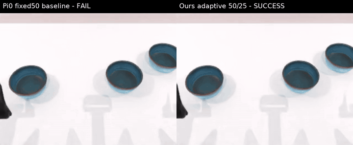
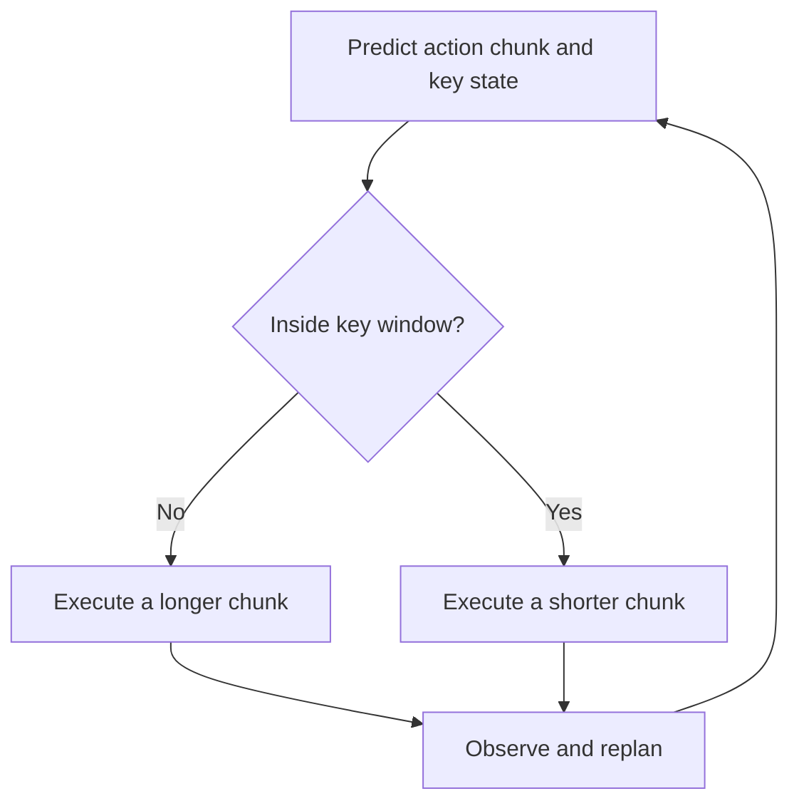

# KeyState-aware VLA

KeyState-aware VLA is a research implementation of adaptive action chunking for vision-language-action models. It augments policy learning with structured task-stage supervision and uses predicted key-state signals to adapt action execution near critical interaction windows.

The project is built around RoboTwin and an OpenPI/Pi0 policy stack. The implementation covers the complete experimental path from trajectory annotation and dataset conversion to auxiliary-head training, key-state fusion, adaptive rollout scheduling, and evaluation.

## Qualitative demo

The following paired rollout shows a representative episode in which the baseline policy fails while KeyState-aware VLA completes the task. The animated preview is stored directly in this repository; click it to open the original H.264 MP4.

[](media/qualitative-comparison.mp4?raw=1)

## Highlights

- Structured key-state supervision derived from scripted robot trajectories
- Dense checkpoint-window labels for time-aware policy learning
- Auxiliary heads for checkpoint type, time-to-entry, semantic phase, latent descriptors, and key poses
- Late cross-attention fusion between action tokens and predicted key-state memory
- Adaptive action execution with different chunk lengths inside and outside key windows
- Offline head diagnostics and rollout-level evaluation utilities
- Reproducible Stage 1, Stage 2, and Stage 3 training configurations
- RoboTwin task support for block-hammering and multi-bowl stacking experiments

## Motivation

Standard VLA policies commonly predict a fixed-length action chunk and execute a fixed number of actions before replanning. This is efficient in free-space motion, but it can be brittle around contact-rich or state-sensitive events. A policy may need coarse, long-horizon motion while approaching an object and short, reactive control when grasping, aligning, striking, or releasing it.

KeyState-aware VLA introduces an explicit representation of these interaction stages. The model learns when a critical window is approaching, what semantic phase the task is in, and what latent or geometric target characterizes the next important state. These signals can be used as auxiliary supervision and as conditioning for action generation.

## System overview

```mermaid
flowchart LR
    A[Scripted robot demonstrations] --> B[Key-state annotation]
    B --> C[Processed trajectory data]
    C --> D[LeRobot dataset]
    D --> E[Stage 1: discrete heads]
    E --> F[Stage 2: latent and pose heads]
    F --> G[Stage 3: key-state fusion]
    G --> H[Adaptive action chunk scheduler]
    H --> I[RoboTwin rollout evaluation]
```



The pipeline separates representation learning from action conditioning. Early stages verify that key-state targets can be predicted accurately before the predicted memory is fused into the action path.

## Key-state representation

The trajectory pipeline stores key-state information under the `keystate` group and converts it into model-ready observation fields.

| Dataset field | Typical shape | Description |
|---|---:|---|
| `next_checkpoint_type` | `[T]` | Type of the current or next checkpoint window |
| `h_entry` | `[T]` | Number of frames before checkpoint-window entry; zero inside the window |
| `semantic_phase` | `[T, C]` | Multi-label semantic phase representation |
| `z_entry_descriptor` | `[T, D]` | Latent descriptor associated with checkpoint entry |
| `keypose_entry_abs` | `[T, 7]` | Absolute entry pose represented as position and quaternion |

The corresponding model observation fields are:

```text
keystate_type
keystate_h_entry
keystate_phase
keystate_z_entry_descriptor
keystate_keypose_entry_abs
```

## Training stages

### Stage 0: trajectory annotation

Stage 0 converts task-program events and trajectory observations into dense supervision. The labeler identifies checkpoint windows, computes time-to-entry targets, assigns semantic phases, and records entry poses.

Primary components:

```text
third_party/RoboTwin/envs/utils/keystate_labeler.py
third_party/RoboTwin/envs/utils/keystate_inspect.py
third_party/RoboTwin/envs/utils/keystate_visualize.py
```

The inspection and visualization tools are intended to catch missing windows, inconsistent transitions, invalid horizons, and skewed label distributions before training.

### Stage 1: discrete key-state heads

Stage 1 adds auxiliary heads while keeping the action-generation path unchanged. The policy predicts:

```text
checkpoint type
h_entry bucket
semantic phase
```

The default `h_entry` discretization is:

| Bin | Frame range | Interpretation |
|---:|---:|---|
| 0 | `h_entry = 0` | Inside a checkpoint window |
| 1 | `1 <= h_entry < 4` | Immediate approach |
| 2 | `4 <= h_entry < 7` | Near-term approach |
| 3 | `7 <= h_entry < 11` | Short horizon |
| 4 | `11 <= h_entry < 21` | Medium horizon |
| 5 | `21 <= h_entry < 51` | Long horizon |
| 6 | `h_entry >= 51` | Distant checkpoint |

### Stage 2: latent and geometric targets

Stage 2 extends the auxiliary objective with:

- `z_entry_descriptor`: a compact latent representation of checkpoint-entry behavior
- `keypose_entry_abs`: a 7D position-and-quaternion target for the checkpoint entry

This stage tests whether the policy representation contains sufficient information to recover more detailed key-state structure before that structure is used to condition action generation.

### Stage 3: key-state-aware action generation

Stage 3 introduces predicted key-state memory into the action path through late cross-attention.

```text
action tokens -----> query
                     |
                     v
              cross-attention -----> residual update -----> action projection
                     ^
                     |
predicted type + horizon + phase + latent descriptor
```

A simplified formulation is:

```text
A = action-token hidden states
K = projected key-state memory tokens
Delta = CrossAttention(query=A, key=K, value=K)
A_fused = A + alpha * Delta
actions = ActionProjection(A_fused)
```

The learnable residual scale `alpha` allows the fusion path to be introduced without discarding the pretrained action representation.

## Adaptive action chunking

The rollout scheduler uses the predicted horizon class to change how many actions are executed before replanning.



A typical two-mode schedule uses a longer chunk outside the key window and a shorter chunk inside it. The exact values are configurable through the rollout scripts:

```text
OUTSIDE_PI0_STEP
INSIDE_PI0_STEP
PI0_STEP_FALLBACK
```

This design preserves efficient motion in predictable regions while increasing replanning frequency around critical events.

## Data flow

```text
RoboTwin demonstrations
        |
        v
raw HDF5 trajectories
        |
        +--> key-state labeling and validation
        |
        v
processed Aloha-style HDF5
        |
        v
LeRobot dataset
        |
        +--> normalization statistics
        +--> Stage 1 supervision
        +--> Stage 2 descriptors and key poses
        |
        v
OpenPI/Pi0 training and rollout evaluation
```

Important conversion utilities include:

```text
third_party/RoboTwin/policy/pi0/scripts/process_data.py
third_party/RoboTwin/policy/pi0/examples/aloha_real/convert_aloha_data_to_lerobot_robotwin.py
third_party/RoboTwin/policy/pi0/scripts/generate_keystate_z_entry_descriptors.py
third_party/RoboTwin/policy/pi0/scripts/inspect_keystate_h_entry_buckets.py
```

## Repository layout

```text
.
├── README.md
├── media/
│   ├── qualitative-comparison-preview.gif
│   └── qualitative-comparison.mp4
└── third_party/
    ├── README.md
    └── RoboTwin/                         # Git submodule
        ├── envs/                         # Tasks and key-state labeling
        ├── policy/pi0/                   # OpenPI/Pi0 integration
        ├── script/                       # Training and rollout entry points
        ├── docs/                         # Technical stage documentation
        └── task_config/                  # RoboTwin task configurations
```

## Quick start

Clone the repository with its submodule:

```bash
git clone --recurse-submodules <repository-url>
cd <repository-directory>
```

For an existing clone:

```bash
git submodule sync --recursive
git submodule update --init --recursive
```

Enter the RoboTwin submodule before running project scripts:

```bash
cd third_party/RoboTwin
```

Runtime environments, datasets, and checkpoints are intentionally not included. Configure them with environment variables or relative local directories. Do not commit generated datasets, checkpoints, videos, or experiment logs.

## Training

The main staged training entry point for the block-hammering pipeline is:

```bash
MODE=train bash script/run_beat_block_hammer_keypose_stage123_train_eval.sh
```

The default staged schedule is:

| Stage | Purpose | Default steps |
|---|---|---:|
| Stage 1 | Discrete checkpoint and phase heads | 5,000 |
| Stage 2 | Latent descriptor and key-pose heads | 5,000 |
| Stage 3 | Predicted key-state fusion | 20,000 |

Common runtime overrides:

```bash
CUDA_VISIBLE_DEVICES=0,1 \
STAGE1_STEPS=5000 \
STAGE2_STEPS=5000 \
STAGE3_STEPS=20000 \
MODE=train \
bash script/run_beat_block_hammer_keypose_stage123_train_eval.sh
```

All storage locations are configurable. Relative defaults are used so the repository does not depend on machine-specific mount points.

## Evaluation

### Official-style rollout evaluation

```bash
VARIANT=keypose \
EVAL_STEPS="5000 10000 15000 20000" \
TEST_NUM=100 \
SEED=0 \
CUDA_VISIBLE_DEVICES=0 \
bash script/run_beat_block_hammer_official_leaderboard_eval.sh
```

### Adaptive Stage 3 evaluation

```bash
CUDA_VISIBLE_DEVICES=0 \
EVAL_CHECKPOINT_ID=10000 \
EVAL_SEEDS="0 1 2" \
TEST_NUM=100 \
EVAL_VIDEO_LOG=0 \
bash script/run_stack_bowls_stage3_pred_adaptive_rollout_eval.sh
```

### Paired comparison

```bash
CUDA_VISIBLE_DEVICES=0 \
TEST_NUM=100 \
bash script/run_stack_bowls_stage3_vs_pi0_paired_eval.sh
```

The paired evaluator records matching episodes for the baseline and key-state-aware policy, writes per-episode logs, and can generate side-by-side comparison videos for disagreement cases.

## Offline diagnostics

`eval_keystate_heads.py` evaluates auxiliary predictions without running a simulator rollout. Reported metrics include:

| Head | Metrics |
|---|---|
| Checkpoint type | Accuracy and confusion matrix |
| Time-to-entry | Bucket accuracy, within-one-bin accuracy, mean bin error |
| Semantic phase | Exact-match accuracy and micro F1 |
| Latent descriptor | Mean squared error and cosine similarity |
| Key pose | Position error and quaternion-angle error |
| Action flow | Teacher-forced flow matching error |

Example:

```bash
cd policy/pi0

python scripts/eval_keystate_heads.py \
  --config-name <config-name> \
  --checkpoint-dir ./checkpoints/<experiment>/<step> \
  --repo-id <validation-repository-id> \
  --batch-size 32 \
  --time-mode beta \
  --output-json ./results/keystate-heads.json
```

## Evaluation protocol notes

RoboTwin evaluation first checks whether a candidate scene is solvable by the scripted expert. Invalid or unstable candidates are skipped before policy evaluation. For comparable aggregate results, keep the task configuration, requested test count, seed group, instruction seed, checkpoint, and action-chunk schedule fixed across variants.

Recommended reporting fields:

```text
task name
task configuration
checkpoint step
model variant
seed group
instruction seed
number of valid episodes
success count and success rate
inside-window chunk length
outside-window chunk length
```

## Key implementation files

| Component | Location |
|---|---|
| Observation schema | `third_party/RoboTwin/policy/pi0/src/openpi/models/model.py` |
| Pi0 model and key-state heads | `third_party/RoboTwin/policy/pi0/src/openpi/models/pi0.py` |
| Key-state input transforms | `third_party/RoboTwin/policy/pi0/src/openpi/policies/keystate.py` |
| Training configurations | `third_party/RoboTwin/policy/pi0/src/openpi/training/config.py` |
| Training entry point | `third_party/RoboTwin/policy/pi0/scripts/train.py` |
| Offline head evaluation | `third_party/RoboTwin/policy/pi0/scripts/eval_keystate_heads.py` |
| Rollout policy entry point | `third_party/RoboTwin/script/eval_policy.py` |
| Key-state labeler | `third_party/RoboTwin/envs/utils/keystate_labeler.py` |

## Configuration surface

The experimental pipeline exposes configuration for:

- Auxiliary-head enablement and loss weights
- Number of checkpoint types and horizon bins
- Semantic phase dimensionality
- Latent descriptor dimensionality
- Key-pose prediction
- Ground-truth or predicted fusion sources
- Cross-attention memory construction
- Adaptive chunk lengths and fallback behavior
- Training steps, checkpoint intervals, and batch sizes
- Evaluation seeds, episode counts, and video logging

Keeping these controls explicit makes it possible to run matched ablations without duplicating the core training or rollout code.

## Reproducibility checklist

Before comparing two variants, verify that:

1. Both use the same processed demonstrations and normalization statistics.
2. The validation repository is not mixed into the training data.
3. Checkpoint initialization is recorded for every stage.
4. The evaluation task configuration and seed protocol are identical.
5. Adaptive scheduling settings are included with every result.
6. Auxiliary-head metrics are checked separately from rollout success.
7. Generated artifacts remain outside version control unless they are intentional documentation assets.

## Current limitations

- Key-state quality depends on the consistency of trajectory annotations.
- Auxiliary-head accuracy does not guarantee improved closed-loop control.
- Absolute key-pose prediction can act as regularization even when it is not directly used by the fusion memory.
- Adaptive chunking changes the policy-observation feedback frequency and should be evaluated independently from representation changes.
- Results can be sensitive to checkpoint selection, simulator filtering, and task-specific window definitions.

## Scope

This repository is an experimental research codebase. It contains implementation and evaluation utilities but does not include training datasets, pretrained model assets, or generated experiment outputs. Users are expected to provide their own compatible runtime environment and data.
